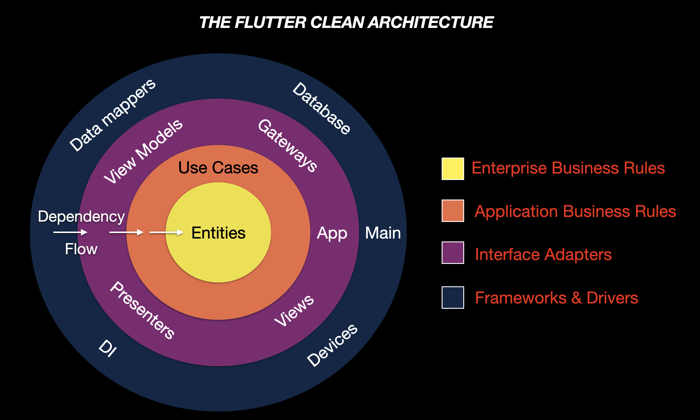
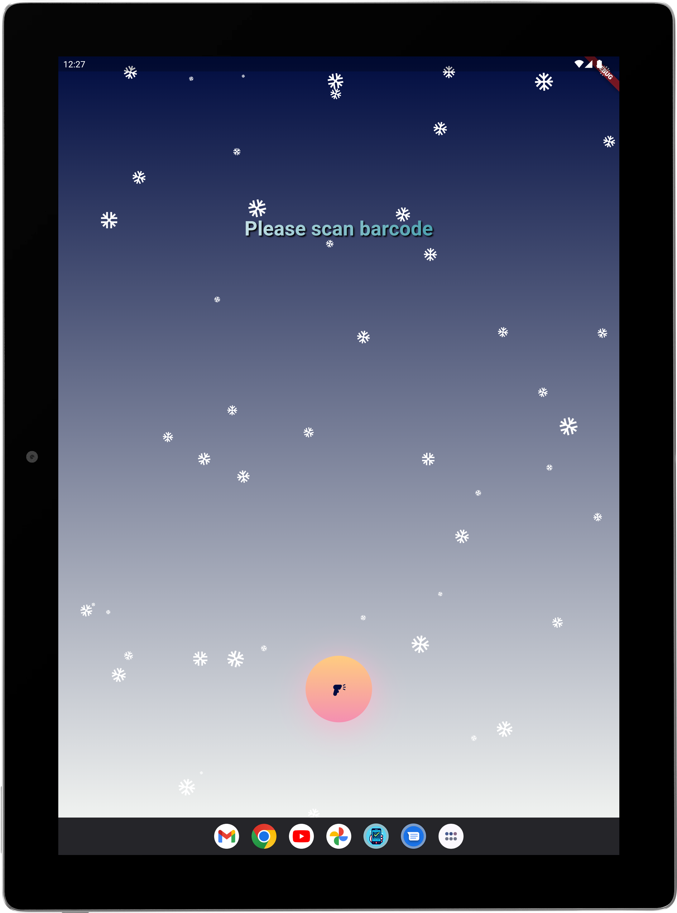
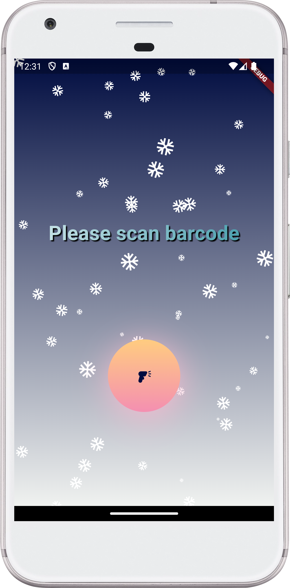
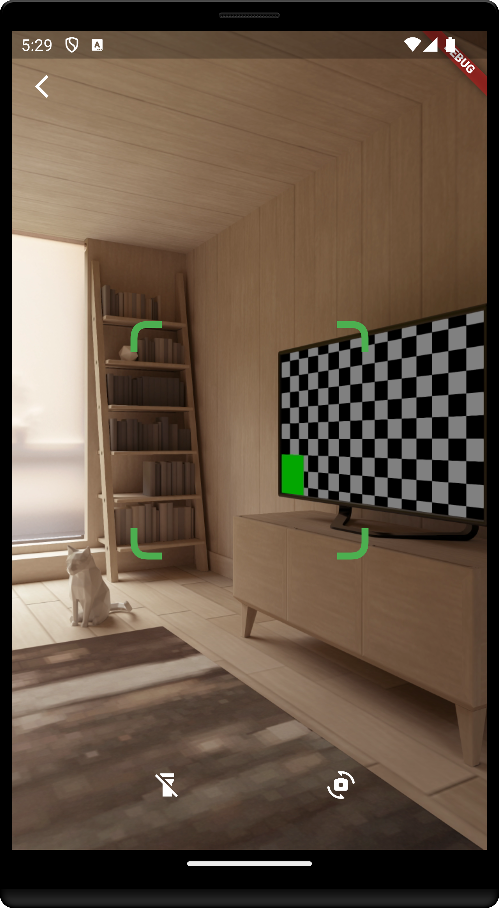

[](https://stand-with-ukraine.pp.ua)
[](https://play.google.com/store/apps/details?id=com.turskyi.ethical_scanner)
[](https://github.com/Turskyi/ethical_scanner/actions/workflows/flutter_ci.yml)
[](https://github.com/flutter/flutter/wiki/Style-guide-for-Flutter-repo)
[](https://pub.dev/packages/flutter_lints)
[](https://codecov.io/gh/Turskyi/ethical_scanner)

[](https://wakatime.com/badge/user/f9df5074-b4ea-4c17-b001-fff428ab82aa/project/86650e58-a90e-4d79-b0c7-d46631f8c1a8)


# Ethical Scanner

**Ethical Scanner** is a Flutter project for building Android and iOS mobile
apps that scans the barcode of a product and tells you if the product meets
your ethical standards.

The app allows you to customize your preferences based on
various criteria, such as human rights, environmental impact, animal well-being,
and more.

The app uses the data from various sources, such as

- [Open Food Facts](https://world.openfoodfacts.org);
- [Yale Chief Executive Leadership Institute](https://www.yalerussianbusinessretreat.com/);
- [Squeezing Putin](https://squeezingputin.com);
- [U.S. bureau of counterterrorism | State Sponsors of Terrorism](https://www.state.gov/state-sponsors-of-terrorism/);
- [European Parliament](https://www.europarl.europa.eu/delegations/en/recognising-the-russian-federation-as-a-/product-details/20221124DPU34521).
- [NATO Parliamentary Assembly](https://www.nato-pa.int/download-file?filename=/sites/default/files/2022-11/RESOLUTION%20479%20-%20%20NATO%20POST%20MADRID%20.pdf)
- [The Sejm of the Republic of Poland](https://www.sejm.gov.pl/media9.nsf/files/ASEA-CM5N53/%24File/Resolution%20on%20the%20recognition%20of%20the%20Russian%20Federation%20as%20a%20state%20supporting%20terrorism.pdf)

The app aims to help you shop with confidence and conscience. For more
information, please visit the project website at
https://ethical-scanner.com.

## PROJECT SPECIFICATION

• Programming language: [Dart](https://dart.dev/);

• SDK: [Flutter](https://flutter.dev/);

• Interface: [Flutter](https://flutter.dev/docs/development/ui);

• Version control system: [Git](https://git-scm.com);

• Git Hosting Service: [GitHub](https://github.com);

• CI/CD: [GitHub Actions](https://docs.github.com/en/actions) is used to deliver
new Android Package (APK) to
[Firebase App Distribution](https://firebase.google.com/docs/app-distribution)
after every push to any other than the **master**
branch, [Codemagic](https://codemagic.io/start/)
is used to deliver new release app bundle to **Google Play** after every merge
(push) to **master** branch;

• State management approach: [BLoC](https://bloclibrary.dev);

• App testing platforms:
[Android Firebase App Distribution](https://appdistribution.firebase.dev/i/ad57d28bed182b15),
[iOS TestFlight](https://testflight.apple.com/join/Wz3XnVAv);

**Code Readability:** code is easily readable with no unnecessary blank lines,
no unused variables or methods, and no commented-out code, all variables,
methods, and resource IDs are descriptively named such that another developer
reading the code can easily understand their function.

# Getting Started

## Contribution

**Ethical Scanner** is an open source project and welcomes contributions from
anyone who is interested. If you want to contribute to Ethical Scanner, you can
follow these steps:

- Fork this repository and clone it to your local machine.
- Create a new branch for your feature or bug-fix.
- Make your changes and commit them with a clear and descriptive message.
- Push your branch to your forked repository and create a pull request to the
  master brunch.
- Wait for your pull request to be reviewed and merged.

Please follow
[the Flutter style guide](https://github.com/flutter/flutter/wiki/Style-guide-for-Flutter-repo)
and code of conduct when contributing to **Ethical Scanner**. You can also use
the issues and discussions tabs to report bugs, request features, or give
feedback.

## Installation

To install **Ethical Scanner**, you need to have Flutter SDK and Android Studio
installed on your machine. You can follow
[the official documentation](https://docs.flutter.dev/get-started/install) to
set up your development environment. To run an **Ethical Scanner** on your
device or emulator, you need to clone this repository and open it in Android
Studio. Then, you can use the run button or the command line to launch the app.
For more information, see the Flutter documentation.

## To create generated files, run:

```
dart run build_runner clean
dart run build_runner build --delete-conflicting-outputs
```

### Data flow

`Device` -> `View` -> `Presenter` -> `Use case` -> `Gateway`
-> `Data Source` -> `Data mapper` -> `Gateway` -> `Use case` -> `Presenter` ->
`View model` ->
`View` -> `Device`

<details style="border: 1px solid #aaa; border-radius: 4px; padding: 0.5em 0.5em 0;">
  <summary style="font-weight: bold; margin: -0.5em -0.5em 0; padding: 0.5em; border-bottom: 1px solid #aaa;">Architectural pattern:

[The Clean Architecture](https://blog.cleancoder.com/uncle-bob/2012/08/13/the-clean-architecture.html)

  </summary>
<a href="https://blog.cleancoder.com/uncle-bob/2012/08/13/the-clean-architecture.html">
<!--suppress CheckImageSize -->

</a>

### Components - `components`

A "component" is a grouping of related functionality behind a nice clean
interface, which resides inside an execution environment like an application.
If the SOLID principles tell us how to arrange the bricks into walls and rooms,
then the component principles tell us how to arrange the rooms into buildings.
Large software systems, like large buildings, are built out of smaller
`components`.
• **REP**: _The Reuse/Release Equivalence Principle_. The granule of reuse is
the granule of release. This means that the classes and modules that are formed
into a component must belong to a cohesive group.
• **CCP**: _The Common Closure Principle_. Gather into components those classes
that change for the same reasons and at the same times. Separate into different
`components` those classes that change at different times and for different
reasons.
• **CRP**: _The Common Reuse Principle_. Don’t force users of a component to
depend on things they don’t need.

## Layers

### Business/Domain - `domain`

In the context of the Clean Architecture by Robert C. Martin, the `domain`
refers to the business logic or domain logic of the application. This is the
innermost circle, which encapsulates business logic (`use_cases`) and
`entities`. Domain models, in general, are designed to be highly reusable and
to encapsulate useful business functionality. The domain layer may contain
entities like `User`, `Role`, `Product`, etc. It’s essentially a collection of
best practice design principles that help us keep business logic together and
minimize the dependencies within the system.

#### Enterprise Business Rules - `entities`

An **Entity** is an object within our computer system that embodies a small set
of critical business rules operating on Critical Business Data. Entities are a
way to implement and enforce application-independent business rules.
Application-independent business rules are rules or procedures that make or
save the business money. Irrespective of whether they were implemented on a
computer, they would make or save money even if they were executed manually.

#### Application Business Rules - `use_cases`

The `use_cases` module defines the business logic of the app. It is a part that
is independent of the development platform, in other words, it is written
purely in the programming language and doesn't contain any elements from the
platform. In the case of `Flutter`, `use_cases` would be written purely in
`Dart` without any `Flutter` elements. The reason for that is that `use_cases`
should only be concerned with the business logic of the app, not with the
implementation details.

#### Interface Adapters - `interface_adapters`

`interface_adapters` is the layer outside `use_cases`. `Interface Adapters`
crosses the boundaries of the layers to communicate with
`Application Business Rules` (Use cases), however, the **Dependency Rule** is
never violated. Using `polymorphism`, `Interface Adapters` communicates with
`Application Business Rules` using inherited classes: classes that implement
or extend the `UseCase`s presented in the `Application Business Rules` layer.
Since `polymorphism` is used, the `Gateways` passed to `Interface Adapters`
still adhere to the **Dependency Rule** since as far as `Interface Adapters` is
concerned, they are abstract. The implementation is hidden behind the
`polymorphism`.

#### Frameworks and drivers – `lib`, `android`, `ios` etc

The `data` module, which is a part of the outermost `lib` component, is
responsible for data retrieval. This can be in the form of API calls to a
server, a local database, or even both. Part of the `Frameworks and drivers`
layer communicates directly with the platform in other words `android` and
`ios`. `Frameworks and drivers` is responsible for Native functionality.
`Frameworks and drivers` calls all Native APIs.

</details>

<details style="border: 1px solid #aaa; border-radius: 4px; padding: 0.5em 0.5em 0;">
  <summary style="font-weight: bold; margin: -0.5em -0.5em 0; padding: 0.5em; border-bottom: 1px solid #aaa;">Style guides:

[Style guide for Flutter](https://github.com/flutter/flutter/wiki/Style-guide-for-Flutter-repo),
[Dart style guide](https://dart.dev/effective-dart).

  </summary>

- [DO use trailing commas for all function calls and declarations unless the function call or definition, from the start of the function name up to the closing parenthesis, fits in a single line.](https://dart-lang.github.io/linter/lints/require_trailing_commas.html)

- [DON'T cast a nullable value to a non-nullable type. This hides a null check and most of the time it is not what is expected.](https://dart-lang.github.io/linter/lints/avoid_as.html)

- [PREFER using
  `const` for instantiating constant constructors](https://dart-lang.github.io/linter/lints/prefer_const_constructors.html)

If a constructor can be invoked as const to produce a canonicalized instance,
it's preferable to do so.

- [DO sort constructor declarations before other members](https://dart-lang.github.io/linter/lints/sort_constructors_first.html)

- ### Avoid Mental Mapping

A single-letter name is a poor choice; it’s just a placeholder that the reader
must mentally map to the actual concept. There can be no worse reason for using
the name `c` than because `a` and `b` were already taken.

- ### Method names

Methods should have verb or verb phrase names like `postPayment`, `deletePage`,
or `save`. Accessors, mutators, and predicates should be named for their value
and prefixed with `get`…, `set`…, and `is`….

- ### Use Intention-Revealing Names

If a name requires a comment, then the name does not reveal its intent.

- ### Use Pronounceable Names

If you can’t pronounce it, you can’t discuss it without sounding like an idiot.

- ### Class Names

Classes and objects should have noun or noun phrase names and not include
indistinct noise words:

```
GOOD:
Customer, WikiPage, Account, AddressParser.

BAD:
Manager, Processor, Data, Info.
```

- ### Functions should be small

Functions should hardly ever be 20 lines long.
Blocks within if statements, else statements, while statements, and so on
should be **_one_** line long. Probably that line should be a function call.

- ### Functions should do one thing

To know that a function is doing more than “one thing” is if you can extract
another function from it with a name that is not merely a restatement of its
implementation.

- ### One Level of Abstraction per Function

We want the code to read like a top-down narrative. We want every function to
be followed by those at the next level of abstraction so that we can read the
program, descending one level of abstraction at a time as we read down the list
of functions.

- ### Dependent Functions

If one function calls another, they should be vertically close, and the caller
should be **_above_** the callee, if possible.

- ### Use Descriptive Names

Don’t be afraid to make a name long. A long descriptive name is better than a
short enigmatic name. A long descriptive name is better than a long descriptive
comment.

- ### Function Arguments

The ideal number of arguments for a function is zero (niladic). Next comes one
(monadic), followed closely by two (dyadic). Three arguments (triadic) should
be avoided where possible.

```
GOOD:
includeSetupPage()

BAD:
includeSetupPageInto(newPageContent)
```

- ### Flag Arguments

Flag arguments are ugly. Passing a boolean into a function is a truly terrible
practice. It immediately complicates the signature of the method, loudly
proclaiming that this function does more than one thing. It does one thing if
the flag is true and another if the flag is false!

```
GOOD:
renderForSuite()
renderForSingleTest()

BAD:
render(bool isSuite)
```

- ### Explain Yourself in Code

Only the code can truly tell you what it does. Comments are, at best, a
necessary evil. Rather than spend your time writing the comments that explain
the mess you’ve made, spend it cleaning that mess. Inaccurate comments are far
worse than no comments at all.

```
BAD:
// Check to see if the employee is eligible
// for full benefits
if ((employee.flags & hourlyFlag) && (employee.age > 65))

GOOD:
if (employee.isEligibleForFullBenefits())

```

- ### TODO Comments

Nowadays, good IDEs provide special gestures and features to locate all the
`//TODO` comments, so it’s not likely that they will get lost.

- ### Public APIs

There is nothing quite so helpful and satisfying as a well-described public API.
It would be challenging, at best, to write programs without them.

```dart
/// dart doc comment
```

- ### Commented-Out Code

We’ve had good source code control systems for a very long time now. Those
systems will remember the code for us. We don’t have to comment it out anymore.

- ### Position Markers

In general, they are the clutter that should be eliminated—especially the noisy
train of slashes at the end. If you overuse banners, they’ll fall into the
background noise and be ignored.

```dart
// Actions //////////////////////////////////
```

- ### Don’t Return Null

When we return `null`, we are essentially creating work for ourselves and
foisting problems upon our callers. All it takes is one missing `null` check to
send an app spinning out of control.

- ### Don’t Pass Null

In most programming languages, there is no **GOOD** way to deal with a `null`
that is passed by a caller accidentally. Because this is the case, the rational
approach is to forbid passing null by default. When you do, you can code with
the knowledge that a `null` in an argument list is an indication of a problem,
and end up with far fewer careless mistakes.

- ### Classes Should Be Small!

With functions, we measured size by counting physical lines. With classes, we
use a different measure. **We count responsibilities.** The Single
Responsibility Principle (SRP) states that a class or module should have one,
and only one, reason to change. The name of a class should describe what
responsibilities it fulfills. The more ambiguous the class name, the more
likely it has too many responsibilities. The problem is that too many of us
think that we are done once the program works. We move on to the next problem
rather than going back and breaking the overstuffed classes into decoupled
units with single responsibilities.

- ### Artificial Coupling

In general, an artificial coupling is a coupling between two modules that
serves no direct purpose. It is a result of putting a variable, constant, or
function in a temporarily convenient, though inappropriate, location. For
example, general `enum`s should not be contained within more specific classes
because this forces the app to know about these more specific classes. The same
goes for general purpose `static` functions being declared in specific classes.

- ### Prefer Polymorphism to If/Else or Switch/Case

There may be no more than one switch statement for a given type of selection.
The cases in that switch statement must create polymorphic objects that take
the place of other such switch statements in the rest of the system.

- ### Replace Magic Numbers with Named Constants

In general, it is a bad idea to have raw numbers in your code. You should hide
them behind well-named constants. The term “Magic Number” does not apply only
to numbers. It applies to any token that has a value that is not
self-describing.

- ## Encapsulate Conditionals

Boolean logic is hard enough to understand without having to see it in the
context of an `if` or `while` statement. Extract functions that explain the
intent of the conditional.

```
GOOD:
if (shouldBeDeleted(timer))

BAD:
if (timer.hasExpired() && !timer.isRecurrent())
```

- ### Avoid Negative Conditionals

Negatives are just a bit harder to understand than positives. So, when
possible, conditionals should be expressed as positives.

```
GOOD:
if (buffer.shouldCompact())

BAD:
if (!buffer.shouldNotCompact())
```

- ### Encapsulate Boundary Conditions

Boundary conditions are hard to keep track of. Put the processing for them in
one place.

```
BAD:
if (level + 1 < tags.length) {
  parts = Parse(body, tags, level + 1, offset + endTag);
  body = null;
}

GOOD:
int nextLevel = level + 1;
if (nextLevel < tags.length) {
  parts = Parse(body, tags, nextLevel, offset + endTag);
  body = null;
}
```

- ### Constants versus Enums

Don’t keep using the old trick of public `static` `final` `int`s. `enum`s can
have methods and fields. This makes them very powerful tools that allow much
more expression and flexibility.

</details>

## Additional information

When it is time to release the system, the process proceeds from the bottom up.
First the `Entities` component is compiled, tested, and released. Then the same
is done for interactors from the `use_cases`. These components are followed by
`interface_adapters` (Presenters, View and ViewModels). `data` and `main` go
last. This process is very clear to deal with. We know how to build the system
because we understand the dependencies between its parts.

# Usage

To use **Ethical Scanner**, you need to grant the app permission to access your
camera. Then, you can scan the barcode of any product by pointing your camera
at it. The app will show you the product name and some information.

• Screenshots:

<!--suppress CheckImageSize -->

<!--suppress CheckImageSize -->

<!--suppress CheckImageSize -->


# Usage

To use **Ethical Scanner**, you need to grant the app permission to access your
camera. Then, you can scan the barcode of any product by pointing your camera at
it. The app will show you the product name and some information.

## Download

<!--suppress HtmlDeprecatedAttribute -->
<p align="center">
  <a href="https://play.google.com/store/apps/details?id=com.turskyi.ethical_scanner" target="_blank">
    
  </a>
  <a href="https://apps.apple.com/ca/app/ethical-scanner/id6743681663" target="_blank">
    
  </a>
</p>

## Web Version

In addition to the Android and iOS apps, **Ethical Scanner** offers web-based
access through the following platforms:

1. **Official Website (Embedded):**

- **URL:**
  [https://ethical-scanner.com/web-app](https://ethical-scanner.com/web-app)
- **Description:** This is the primary web presence where you can find the
  embedded version of the Ethical Scanner. It provides the same core
  functionality as the mobile apps.
- _Note: The availability of this custom domain depends on continued
  registration._

2. **Firebase Hosting (Direct Access):**

- **URL:** [https://ethical-scanner.web.app](https://ethical-scanner.web.app)
- **Description:** This provides direct access to the web-deployed version of
  the Flutter application, hosted on Firebase. It allows users to experience the
  app's features directly in their browser.

3. **Vercel Hosting (Alternative/Stable Access):**

- **URL:**
  [https://ethical-scanner-web.vercel.app](https://ethical-scanner-web.vercel.app)
- **Description:** This URL also hosts a web version of the Ethical Scanner. It
  serves as a stable, long-term accessible alternative, particularly as it's
  hosted on Vercel's free tier.

All web versions aim to provide the same functionality as the mobile apps,
allowing you to scan barcodes (if your browser and device support camera access
for web pages) and check product information directly from your browser.

**Note:**  
The landing page and backend for Ethical Scanner are managed in a separate
repository:  
➡️ [ethical_scanner_web (Next.js)](https://github.com/Turskyi/ethical_scanner_web)

## Project Management

This project's development is managed using GitHub Projects. You can view our
current tasks, progress, and roadmap here:

- **Project Board:**
  [Ethical Scanner - Project Roadmap](https://github.com/users/Turskyi/projects/10)
